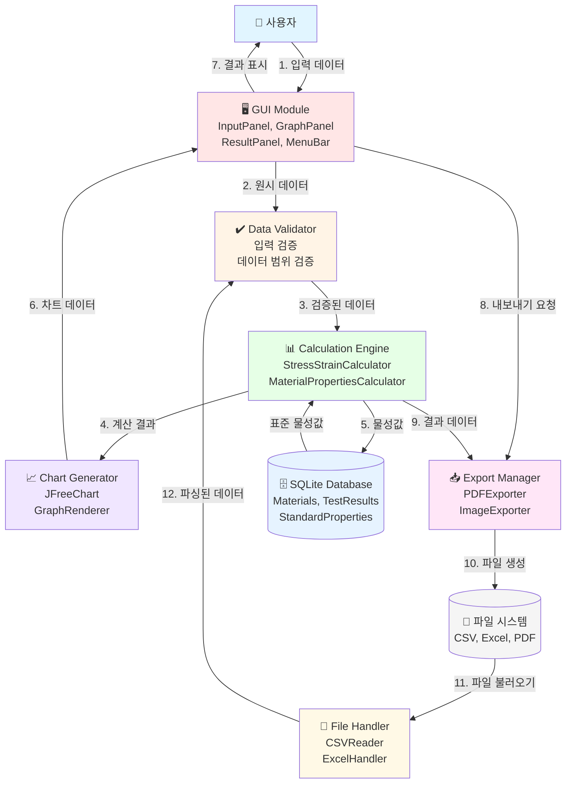

# MEVA 데이터 플로우 다이어그램

## 1. 개요

이 문서는 MEVA (Materials Engineering Visualization and Analysis) 시스템의 데이터 흐름을 설명합니다. 재료공학 학부생을 위한 인장시험 데이터 분석 및 시각화 교육용 프로그램으로서, 다양한 모듈 간의 데이터 처리 흐름을 시각화합니다.

## 2. 전체 데이터 플로우 다이어그램



## 3. 상세 데이터 플로우

### 3.1 입력 단계 (Input Phase)

**주체**: 사용자 → GUI Module → Data Validator

```
[사용자 입력]
│
└──> InputPanel
      │
      ├─> 재료 정보 (이름, 타입, 치수)
      ├─> 시험 조건 (온도, 속도, 방법)
      └─> 데이터 소스 (수동 입력 / 파일 불러오기)
      │
      v
[InputValidator]
      │
      ├─> 필수 필드 검증
      ├─> 데이터 타입 검증
      ├─> 범위 검증 (음수값, 이상값 확인)
      └─> 에러 메시지 생성
```

**데이터 형식**:
```json
{
  "materialInfo": {
    "name": "AISI 304 Stainless Steel",
    "type": "Stainless Steel",
    "length": 50.0,
    "width": 12.5,
    "thickness": 2.0
  },
  "testConditions": {
    "temperature": 25.0,
    "strainRate": 0.001,
    "testMethod": "Tensile"
  }
}
```

### 3.2 검증 단계 (Validation Phase)

**주체**: Data Validator

```
[DataRangeValidator]
      │
      ├─> 길이/넓이/두께: 0 < value < 1000 mm
      ├─> 온도: -273 < value < 2000 °C
      ├─> 변형률: 0 < value < 1.0
      └─> 응력: 0 < value < 10000 MPa
      │
      v
[FileFormatValidator] (파일 입력 시)
      │
      ├─> CSV: 열 구조 확인, 구분자 검증
      ├─> Excel: 시트 구조 확인, 셀 형식 검증
      └─> 인코딩 확인 (UTF-8)
```

### 3.3 계산 단계 (Calculation Phase)

**주체**: Calculation Engine ↔ Database Manager

```
[StressStrainCalculator]
      │
      ├─> 단면적 계산: A = width × thickness
      ├─> 응력 계산: σ = F / A
      ├─> 변형률 계산: ε = ΔL / L₀
      └─> 응력-변형률 경로 생성
      │
      v
[MaterialPropertiesCalculator]
      │
      ├─> 영률(E): 탄성 구간 기울기
      ├─> 항복강도(σy): 0.2% offset method
      ├─> 인장강도(σUTS): 최대 응력
      ├─> 연신율: 파단 시 변형률
      └─> 전단 계수(G): G = E / 2(1+ν)
      │
      <--> [DatabaseManager]
            │
            ├─> StandardProperties 조회
            └─> TestResults 저장
```

**계산 데이터 형식**:
```json
{
  "stressStrainData": {
    "points": [
      {"strain": 0.0, "stress": 0.0},
      {"strain": 0.001, "stress": 200.0},
      {"strain": 0.002, "stress": 400.0}
    ]
  },
  "materialProperties": {
    "youngsModulus": 200000.0,
    "yieldStrength": 250.0,
    "tensileStrength": 520.0,
    "elongation": 45.0,
    "shearModulus": 80000.0
  }
}
```

### 3.4 물성 분석 단계 (Analysis Phase)

**주체**: Material Properties Calculator ↔ Database

```
[물성값 분석]
      │
      ├─> 표준값과 비교
      │   │
      │   └─> StandardProperties 테이넷 조회
      │
      ├─> 오차율 계산
      │   │
      │   └─> Error% = |(측정값 - 표준값) / 표준값| × 100
      │
      ├─> 품질 평가
      │   │
      │   ├─> 오차 1% 이내: 우수
      │   ├─> 오차 1-5%: 양호
      │   └─> 오차 5% 초과: 재검토 필요
      │
      └─> 분석 보고서 생성
```

### 3.5 시각화 단계 (Visualization Phase)

**주체**: Chart Generator → GUI Module

```
[ChartGenerator]
      │
      ├─> JFreeChart 객체 생성
      │   │
      │   ├─> XYLineChart: 응력-변형률 곡선
      │   ├─> BarChart: 물성값 비교
      │   └─> ScatterPlot: 데이터 포인트
      │
      ├─> 그래프 스타일링
      │   │
      │   ├─> 축 레이블 설정
      │   ├─> 범례 추가
      │   ├─> 그리드 라인 설정
      │   └─> 색상 테마 적용
      │
      └─> GraphPanel로 전달
          │
          └─> 실시간 렌더링
```

### 3.6 출력 단계 (Export Phase)

**주체**: Export Manager → File System

```
[Export Manager]
      │
      ├─> [PDFExporter]
      │   │
      │   ├─> iText 라이브러리 사용
      │   ├─> 보고서 레이아웃 구성
      │   ├─> 그래프 이미지 삽입
      │   ├─> 물성값 테이블 추가
      │   └─> PDF 파일 생성
      │
      ├─> [ImageExporter]
      │   │
      │   ├─> PNG/JPG/SVG 형식 지원
      │   ├─> 해상도 설정 (DPI)
      │   └─> 투명도 옵션
      │
      └─> [ExcelHandler]
          │
          ├─> Apache POI 사용
          ├─> 데이터 시트 생성
          ├─> 차트 시트 생성
          └─> .xlsx 파일 저장
```

## 4. 주요 컴포넌트별 데이터 흐름

### 4.1 GUI Module

**입력**:
- 사용자 이벤트 (마우스 클릭, 키보드 입력)
- 차트 데이터 (ChartGenerator로부터)
- 계산 결과 (Calculator로부터)

**출력**:
- 검증 요청 (Validator로)
- 내보내기 요청 (Exporter로)
- 시각적 피드백 (사용자에게)

**데이터 변환**:
```
사용자 입력 → MaterialInput 객체 → Validator
계산 결과 → 테이블/그래프 표시 → GUI 컴포넌트
```

### 4.2 Data Validator

**입력**:
- MaterialInput 객체 (GUI로부터)
- 파일 데이터 (FileHandler로부터)

**출력**:
- ValidatedData 객체 (Calculator로)
- ValidationError 리스트 (GUI로)

**검증 규칙**:
```java
// 예시 검증 로직
if (length <= 0 || length > 1000) {
    throw new ValidationException("길이는 0-1000mm 범위여야 합니다");
}

if (temperature < -273 || temperature > 2000) {
    throw new ValidationException("온도 범위 초과");
}
```

### 4.3 Calculation Engine

**입력**:
- ValidatedData (Validator로부터)
- StandardProperties (Database로부터)

**출력**:
- StressStrainData (Visualizer로)
- MaterialProperties (Database로, GUI로)
- AnalysisReport (GUI로)

**계산 알고리즘**:
```
1. 단면적 계산: A = width × thickness
2. 응력 계산: σ = F / A
3. 변형률 계산: ε = ΔL / L₀
4. 영률 계산: E = (σ₂ - σ₁) / (ε₂ - ε₁) [탄성 구간]
5. 항복강도: 0.2% offset line 교점
6. 인장강도: max(σ)
```

### 4.4 Database Manager

**주요 연산**:

```sql
-- 재료 정보 저장
INSERT INTO Materials (name, type, youngs_modulus, yield_strength)
VALUES (?, ?, ?, ?);

-- 시험 결과 저장
INSERT INTO TestResults (material_id, test_date, calculated_properties)
VALUES (?, ?, ?);

-- 표준 물성값 조회
SELECT property_value FROM StandardProperties
WHERE material_name = ? AND property_name = ?;
```

**데이터 흐름**:
```
[Calculator] → save(MaterialProperties) → [DB]
[DB] → load(StandardProperties) → [Calculator]
[Calculator] → save(TestResults) → [DB]
```

### 4.5 File Handler

**CSV 파일 처리**:
```
CSV 파일 → CSVReader
    ↓
1. 헤더 파싱
2. 데이터 행 읽기
3. 타입 변환 (String → Double)
4. RawData 객체 생성
    ↓
Validator로 전달
```

**Excel 파일 처리**:
```
Excel 파일 → ExcelHandler
    ↓
1. Workbook 열기 (Apache POI)
2. 첫 번째 시트 선택
3. 셀 데이터 읽기
4. 수식 평가
5. RawData 객체 생성
    ↓
Validator로 전달
```

## 5. 에러 처리 및 예외 흐름

### 5.1 에러 전파 체인

```
[입력 에러]
    ↓
[Validator] → ValidationException
    ↓
[GUI] → 에러 다이얼로그 표시
    ↓
[사용자] → 수정 입력

[계산 에러]
    ↓
[Calculator] → CalculationException
    ↓
[GUI] → 경고 메시지 + 로그 기록
    ↓
[사용자] → 데이터 재확인

[파일 I/O 에러]
    ↓
[FileHandler] → IOException
    ↓
[GUI] → 파일 선택 재시도
```

### 5.2 예외 처리 전략

**재시도 가능한 에러**:
- 파일 읽기 실패
- 데이터베이스 연결 실패
- 네트워크 타임아웃

**즉시 중단 에러**:
- 데이터 타입 불일치
- 필수 필드 누락
- 메모리 부족

## 6. 성능 고려사항

### 6.1 데이터 처리 최적화

```
대용량 데이터 (>10,000 포인트)
    ↓
[다운샘플링]
    ├─> 시각화용: 1,000 포인트로 축소
    └─> 계산용: 전체 데이터 사용
    ↓
처리 시간 단축 (1초 이내)
```

### 6.2 메모리 관리

```
[데이터 로딩]
    ↓
스트리밍 방식 사용 (파일이 큰 경우)
    ↓
메모리 버퍼: 최대 100MB
    ↓
[가비지 컬렉션] 최적화
```

### 6.3 캐싱 전략

```
[StandardProperties]
    ↓
앱 시작 시 메모리에 로드
    ↓
반복 조회 시 DB 접근 불필요
    ↓
성능 향상: ~90% 응답 시간 단축
```

## 7. 참고 문서

- [시스템 아키텍처 문서](./system-architecture.md)
- [데이터베이스 ERD](./meva_docs_database_erd.md)
- [CRUD 인터페이스 설계](./meva_docs_crud_interface_design.md)
- [모듈 간 인터페이스 정의](./system-architecture.md#33-모듈-간-인터페이스)

## 8. 버전 정보

**문서 버전**: v1.0  
**최종 수정일**: 2025-11-11  
**작성자**: 김세현 (MEVA 프로젝트 팀)  
**프로젝트**: MEVA (Materials Engineering Visualization and Analysis)
