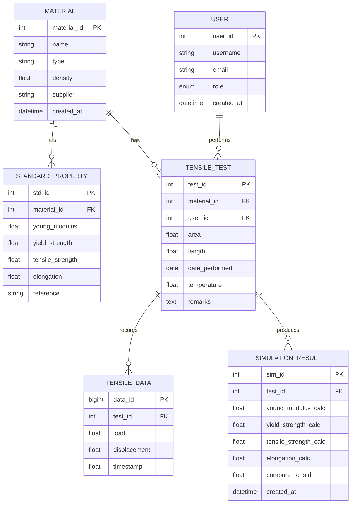

# MEVA — Database ERD & Schema

> File: `MEVA/docs/database-erd.md`

## 목적
이 문서는 **재료 인장시험(Tensile Test) 및 물성 데이터 관리 시스템**의 데이터베이스 ERD, 테이블 정의, 제약조건, CRUD API 스펙, 대용량 데이터 처리 전략 및 표준값 비교 로직을 문서화합니다.

---

## 1. 개요 ERD (Mermaid)


---

## 2. 테이블 상세 정의 (PostgreSQL 예시)

### 2.1 `material`
```sql
CREATE TABLE material (
  material_id SERIAL PRIMARY KEY,
  name VARCHAR(100) NOT NULL UNIQUE,
  type VARCHAR(50),
  density REAL CHECK (density > 0),
  supplier VARCHAR(255),
  created_at TIMESTAMP WITH TIME ZONE DEFAULT now()
);
```

### 2.2 `standard_property`
```sql
CREATE TABLE standard_property (
  std_id SERIAL PRIMARY KEY,
  material_id INT NOT NULL REFERENCES material(material_id) ON DELETE CASCADE,
  young_modulus REAL CHECK (young_modulus > 0),
  yield_strength REAL CHECK (yield_strength > 0),
  tensile_strength REAL CHECK (tensile_strength > 0),
  elongation REAL CHECK (elongation >= 0),
  reference TEXT
);
```

### 2.3 `tensile_test`
```sql
CREATE TABLE tensile_test (
  test_id SERIAL PRIMARY KEY,
  material_id INT NOT NULL REFERENCES material(material_id) ON DELETE RESTRICT,
  user_id INT REFERENCES "user"(user_id) ON DELETE SET NULL,
  area REAL CHECK (area > 0),
  length REAL CHECK (length > 0),
  date_performed DATE,
  temperature REAL,
  remarks TEXT
);
```

### 2.4 `tensile_data` (시계열 — 대용량 고려)
```sql
CREATE TABLE tensile_data (
  data_id BIGSERIAL PRIMARY KEY,
  test_id INT NOT NULL REFERENCES tensile_test(test_id) ON DELETE CASCADE,
  load REAL,
  displacement REAL,
  timestamp REAL
);
-- 인덱스
CREATE INDEX idx_tensiledata_test_ts ON tensile_data (test_id, timestamp);
-- 권장: 파티셔닝 (예: RANGE ON test_id 또는 날짜 기반)
```

### 2.5 `simulation_result`
```sql
CREATE TABLE simulation_result (
  sim_id SERIAL PRIMARY KEY,
  test_id INT NOT NULL REFERENCES tensile_test(test_id) ON DELETE CASCADE,
  young_modulus_calc REAL,
  yield_strength_calc REAL,
  tensile_strength_calc REAL,
  elongation_calc REAL,
  compare_to_std REAL,
  created_at TIMESTAMP WITH TIME ZONE DEFAULT now()
);
CREATE INDEX idx_sim_test ON simulation_result (test_id);
```

### 2.6 `user`
```sql
CREATE TABLE "user" (
  user_id SERIAL PRIMARY KEY,
  username VARCHAR(80) NOT NULL UNIQUE,
  email VARCHAR(200) NOT NULL UNIQUE,
  role VARCHAR(20) NOT NULL DEFAULT 'researcher',
  created_at TIMESTAMP WITH TIME ZONE DEFAULT now()
);
```

---

## 3. 제약조건(Integrity) 요약
- Primary Key: 각 테이블의 `*_id` 컬럼
- Foreign Key: `material_id`, `test_id`, `user_id` 등으로 참조 무결성 확보
- Unique: `material.name`, `user.email`, `user.username`
- Check constraints: 물리량은 음수 불허 등
- Cascade rules: `ON DELETE CASCADE`는 시험(test) 삭제 시 원시 데이터 및 시뮬레이션 결과 자동 삭제

---

## 4. 대용량 데이터(시계열) 최적화 권장
1. **분리 저장소**: 하중-변위 대용량 시계열은 TimescaleDB( PostgreSQL 확장) 또는 ClickHouse, InfluxDB 같은 시계열 DB로 분리
2. **파티셔닝**: PostgreSQL 파티셔닝 (LIST/RANGE — 예: test_id 또는 date 기반)
3. **배치 로드**: 대량 업로드는 COPY/Batch insert 사용
4. **압축 & 컬럼형 포맷**: 장기 보존 데이터는 Parquet로 보관
5. **스트리밍(Chunked API)**: 웹 UI는 청크 단위로 불러오기 (예: 1k~10k row 단위)
6. **인덱스 전략**: 조회 패턴 기반 최소한의 복합 인덱스 `(test_id, timestamp)`
7. **자료 보관 정책**: 원시 샘플은 보존 기간을 두고, 요약(예: 1s→10s 평균)본을 보존

---

## 5. 표준값 비교 로직(예)
- **오차율** = `(calc - std) / std * 100`
- 비교 임계값 예: 영률 ±5%, 항복강도 ±3%, 인장강도 ±3%, 연신율 ±5%

예시 SQL(단일 test 비교):
```sql
SELECT s.std_id, s.young_modulus AS std_young, r.young_modulus_calc AS calc_young,
       (r.young_modulus_calc - s.young_modulus)/s.young_modulus*100 AS pct_diff
FROM simulation_result r
JOIN tensile_test t ON r.test_id = t.test_id
JOIN standard_property s ON t.material_id = s.material_id
WHERE r.test_id = :test_id
ORDER BY r.created_at DESC
LIMIT 1;
```

---

## 6. API / 함수 스펙 (REST 예시)

### 인증 및 공통
- 인증: JWT 기반
- 응답: JSON
- 공통 오류 포맷: `{ "error": { "code": 123, "message": "..." } }`

### 엔드포인트
- `POST /api/materials` — 재료 생성
  - body: `{ name, type, density, supplier }`
  - returns: created material

- `GET /api/materials` — 재료 리스트
  - query: `?q=&page=&size=`

- `POST /api/tests` — 인장시험 메타데이터 등록
  - body: `{ material_id, user_id, area, length, date_performed, temperature, remarks }`

- `POST /api/tests/{test_id}/data` — 시계열 데이터 업로드 (multipart 또는 stream)
  - accepts: CSV (recommended columns: load, displacement, timestamp) or binary chunk
  - behavior: 서버는 업로드된 파일을 파싱하여 batch INSERT 또는 외부 시계열 DB로 전달

- `GET /api/tests/{test_id}/data?start=&end&downsample=` — 시계열 조회 (청크/다운샘플 지원)

- `POST /api/tests/{test_id}/simulate` — 시뮬레이션/계산 실행
  - returns: simulation_result entry (async job id or sync result depending on 데이터 크기)

- `GET /api/tests/{test_id}/compare` — 계산 결과와 표준값 비교 리포트
  - returns: 비교 결과 JSON, 차트 메타데이터

---

## 7. 예시: 대용량 업로드 워크플로
1. 클라이언트: CSV or Parquet 업로드 (multipart) → `/api/tests/{id}/data`
2. 서버: 파일을 임시 저장 → 백그라운드 작업(Worker)에 전달 (예: Celery, Sidekiq)
3. Worker: 파일을 청크로 읽어 시계열 DB에 INSERT(또는 COPY)
4. 완료 후: Simulation 작업 트리거 (동기/비동기 선택 가능)

> 참고: 이 문서에서는 사용자 요청에 따라 비동기 처리를 권장하지만, 구현 시 **작업 상태 확인 API** (`GET /api/jobs/{job_id}`)를 제공하세요.

---

## 8. 표준 물성값(샘플 테이블)
`standard_property` 테이블을 이용해 주요 재료(철, 구리, 알루미늄 등)의 대표 표준값을 입력할 수 있습니다.

예: CSV 샘플 컬럼 — `material_name, young_modulus_GPa, yield_strength_MPa, tensile_strength_MPa, elongation_pct, reference`

---

## 9. 확장 고려사항
- **멀티테넌시**(Organization/Project 기준 권한 분리)
- **데이터 암호화**: 민감한 사용자/시험 정보 암호화
- **감사 로그(Audit log)**: 데이터 변경 이력 기록
- **모델 버전 관리**: 시뮬레이션 알고리즘/파라미터 버전 기록(테이블: `simulation_model_version`)

---

## 10. 부록: ERD 이미지/다이어그램
- 이 Markdown 파일은 mermaid 블록을 포함합니다. 필요한 경우 draw.io 또는 dbdiagram.io 내보내기용 JSON을 추가 제작해 드립니다.

---

_작성일: 2025-11-07_

