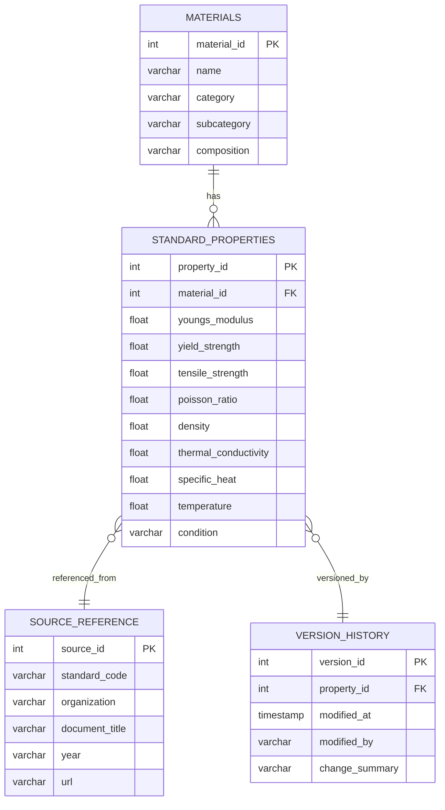

# MEVA — 표준 물성값 데이터베이스 구축 계획서

> File: `MEVA/docs/standard-properties-db.md`

본 문서는 **MEVA(Material Evaluation & Verification Architecture)** 시스템의 표준 물성값(Standard Material Properties) 데이터베이스를 구축하기 위한 세부 설계 및 실행 계획을 기술한다.  
목표는 실험 계산 결과의 검증 및 비교를 위한 **정확하고 신뢰성 있는 표준 데이터 세트**를 구축하는 것이다.

---

## 1. 구축 목적 및 필요성

| 항목 | 설명 |
|------|------|
| **목적** | 실험·시뮬레이션 결과와의 오차 검증 및 재료 분류 기준 확보 |
| **필요성** | 연구, 시뮬레이션, 산업 인증 과정에서 표준화된 기준값 확보 |
| **활용 범위** | 인장시험, 열처리 특성 비교, 유한요소해석(FEA) 입력값, 재료 추천 알고리즘 학습 데이터 |

---

## 2. 데이터베이스 구조 개요

### 2.1 주요 엔티티
- `materials` — 재료 기본 정보
- `standard_properties` — 표준 물성값 (온도·상태별)
- `source_reference` — 출처 및 표준 규격 정보
- `version_history` — 데이터 수정 이력 관리

### 2.2 ER 다이어그램 (개요)


---

## 3. 데이터 수집 및 검증 계획

### 3.1 수집 소스
| 출처 유형 | 예시 |
|------------|------|
| 국제 표준 | ASTM, ISO, DIN, JIS, KS |
| 국가 DB | NIST, MatWeb, Japan Material Data Center |
| 논문 데이터 | Elsevier, Springer, Wiley 재료 데이터 |
| 기업 DB | 금속소재 업체 사양서 |

### 3.2 검증 절차
1. **이중 확인(Double Validation)** – 두 개 이상의 출처가 동일 값을 제시하는 경우만 승인  
2. **신뢰도 등급 부여**  
   - A: 국제표준 문서 기반  
   - B: 국가기관 DB 기반  
   - C: 논문·논문집  
   - D: 기업 사양서 또는 비공식 소스  
3. **데이터 정규화**  
   - 단위 일관성 (SI 단위로 통일, 예: MPa, GPa, kg/m³)  
   - 온도 표준화 (기본 25℃ 기준, 변환식 적용)

---

## 4. 데이터 정규화 및 관리 정책

| 항목 | 규칙 |
|------|------|
| **데이터 타입** | `DOUBLE PRECISION` 사용 (소수점 이하 6자리) |
| **단위 통일** | 국제단위계(SI): `E (Pa)`, `σy (MPa)`, `ρ (kg/m³)` |
| **온도 조건** | 표준온도(25℃) 기준, 변온 데이터는 별도 테이블 관리 |
| **중복 방지** | `(material_id, temperature, condition)`를 UNIQUE 제약 |
| **버전 관리** | 업데이트 시 이전 레코드는 version_history에 기록 |

---

## 5. 데이터베이스 구축 단계별 계획

| 단계 | 내용 | 기간(예상) |
|------|------|-----------|
| 1단계 | 스키마 설계 및 기본 테이블 생성 | 1주 |
| 2단계 | 국제표준(ISO, ASTM) 기반 1차 데이터 수집 | 2주 |
| 3단계 | 검증 알고리즘 및 품질 필터 구축 | 1주 |
| 4단계 | 국가/논문 데이터 추가 통합 | 2주 |
| 5단계 | 버전관리 및 API 연동 구현 | 1주 |
| **총합** | **7주** |

---

## 6. 데이터 접근 및 활용 API

| 기능 | 엔드포인트 | 설명 |
|------|-------------|------|
| 조회 | `GET /api/standard-properties/{material}` | 재료별 표준값 조회 |
| 비교 | `GET /api/compare/{material}/{test_id}` | 실험결과와 표준값 비교 |
| 등록 | `POST /api/standard-properties` | 신규 표준값 등록 |
| 수정 | `PUT /api/standard-properties/{id}` | 표준값 수정 및 버전기록 추가 |
| 검증 | `GET /api/validation-report` | 데이터 품질 리포트 반환 |

---

## 7. 성능 및 확장 고려사항

- **인덱싱:** `material_id`, `(material_id, temperature)` 복합 인덱스  
- **캐싱:** Redis에 표준값 캐시 (조회속도 향상)  
- **버전 압축:** 오래된 버전은 JSON diff로 저장  
- **API 레벨 스로틀링:** 요청 폭주 방지 (예: 100req/s 제한)  
- **백업 주기:** 주 1회 dump + 월별 snapshot

---

## 8. 검증 및 연계 시스템

- **검증 스크립트:** 실험데이터 DB와 비교하여 오차율(`|E_exp - E_std| / E_std`) 계산
- **시각화:** Plotly 기반 UI에서 표준 vs 측정 곡선 비교
- **자동 알림:** 표준값과 ±5% 이상 차이 발생 시 Slack/Webhook 알림

---

## 9. 예시 SQL (PostgreSQL)

```sql
CREATE TABLE materials (
  material_id SERIAL PRIMARY KEY,
  name VARCHAR(64) NOT NULL,
  category VARCHAR(32),
  subcategory VARCHAR(32),
  composition TEXT
);

CREATE TABLE standard_properties (
  property_id SERIAL PRIMARY KEY,
  material_id INT REFERENCES materials(material_id),
  youngs_modulus DOUBLE PRECISION,
  yield_strength DOUBLE PRECISION,
  tensile_strength DOUBLE PRECISION,
  poisson_ratio DOUBLE PRECISION,
  density DOUBLE PRECISION,
  thermal_conductivity DOUBLE PRECISION,
  specific_heat DOUBLE PRECISION,
  temperature DOUBLE PRECISION DEFAULT 25.0,
  condition VARCHAR(32),
  UNIQUE(material_id, temperature, condition)
);
```

---

## 10. 향후 확장 계획
- 복합소재, 고분자, 세라믹 등 비금속 재료 확장
- 머신러닝 기반 “유사 재료 추천” 기능 개발
- API 연동: MEVA 실험 검증 시스템과 실시간 오차율 계산

---

_작성일: 2025-11-07_